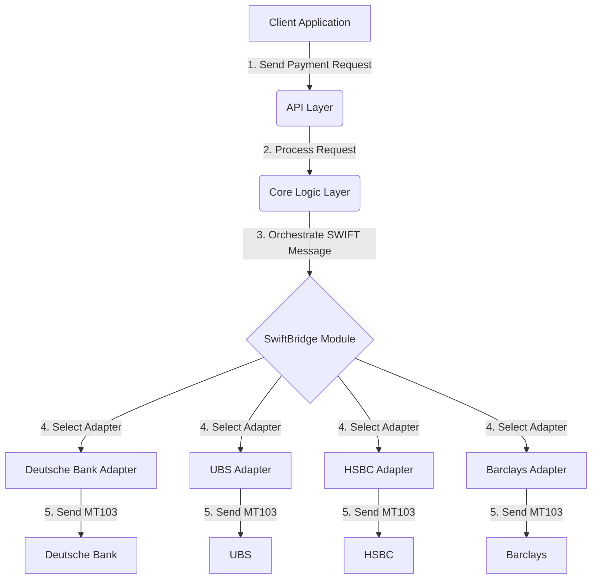

<h1 align="center">💳 SWIFT-BRIDGE by Kongali1720</h1>
<p align="center">
<b>A Modular SWIFT (MT103 / ISO 20022) Transaction Simulation & Integration System</b>
</p>

<p align="center">


</p>

<p align="center">
🌐 <b>Live System:</b>  
👉 <a href="https://swift-bridge.younext.cloud/">https://swift-bridge.younext.cloud/</a>
</p>

---

> A unified middleware platform for seamless global transactions, connecting your systems to major banks like **Deutsche Bank, UBS, HSBC, and Barclays** through a single, secure API.  
> *“Building the digital future of finance, one transaction at a time.”*


---

## 🚀 Project Description

**SwiftBridge** is a flagship project from the **KONGALI – Web3 • Blockchain • Cyber Lab**. It is a robust middleware platform designed to simplify and automate SWIFT transactions, providing a single, unified API to connect with major global banks.

This project showcases the lab's capability in building enterprise-grade financial systems that are secure, scalable, and efficient, focusing on solving real-world problems in the financial sector.

---

## 🌟 Key Features

-   **🔗 Unified Multi-Bank Connectivity:** Access multiple global banks through a single, consistent API endpoint.
-   **📊 Real-Time Transparency:** Monitor every transaction with an interactive dashboard for full visibility from submission to settlement.
-   **🔐 Enterprise-Grade Security:** Built with security in mind, featuring end-to-end encryption and a complete audit trail.
-   **⚙️ Automated & Efficient:** Reduces manual intervention and errors by automatically validating, building, and sending standards-compliant SWIFT messages (MT103).
-   **📈 Scalable Architecture:** Easily add new banking partners in the future without disrupting existing code, thanks to a modular design using the **Adapter Pattern**.

## 🚀 Live Demo

See the platform in action! Our interactive website demonstrates the user interface, key features, and the professional dashboard designed for financial institutions.

**[➡️ View Live Demo Website](https://kongali1720.github.io/swiftbridge-financial-system/)**

---

## 🏗️ Technical Architecture

The project is built with a focus on scalability, maintainability, and security, following best practices in software design.

### High-Level Design

The system is composed of three main layers: an API Layer, a Core Logic Layer, and the SwiftBridge Module, which handles all SWIFT-related communication using specific adapters for each bank.



---

## 📂 Project Folder Structure

Here is the complete folder structure for the **SwiftBridge** project. This design emphasizes modularity, scalability, and maintainability, following best practices in software architecture.

```text
financial-transaction-system/
├── src/
│   ├── api/                          # (Entry Point) API endpoints to receive transaction requests
│   │   ├── controllers/
│   │   │   └── transaction_controller.js  # Handles HTTP requests, calls the service layer
│   │   └── middleware/
│   │       └── auth.js                    # Middleware for authentication and authorization
│   │
│   ├── core/                         # (Business Logic) Core logic of your application
│   │   ├── services/
│   │   │   ├── payment_service.js         # Business logic for processing payments
│   │   │   └── transaction_service.js     # Manages internal transaction data
│   │   └── models/
│   │       ├── Transaction.js             # Your internal transaction data model
│   │       └── User.js                    # User data model
│   │
│   ├── swiftbridge/                  # (Core Module) Specific module for SWIFT communication
│   │   ├── config/
│   │   │   └── bank_config.json           # Configuration for each bank (endpoints, specific formats, etc.)
│   │   │
│   │   ├── core/                       # Common logic not specific to a single bank
│   │   │   ├── SwiftMessageFactory.js    # Factory for creating SWIFT message objects (MT103, MT199, etc.)
│   │   │   └── SwiftBridgeOrchestrator.js # Main orchestrator: selects adapter, sends messages, handles responses
│   │   │
│   │   ├── messages/                    # Definitions and parsers for various SWIFT message types
│   │   │   ├── MT103/
│   │   │   │   ├── MT103Builder.js       # Builds an MT103 message from internal data
│   │   │   │   ├── MT103Parser.js        # Parses incoming MT103 messages
│   │   │   │   └── MT103Validator.js     # Validates fields according to SWIFT standards
│   │   │   └── ... (other message types like MT940, MT942)
│   │   │
│   │   └── adapters/                    # Specific implementation for each bank (Adapter Pattern)
│   │       ├── base_adapter.js          # Abstract class or interface that must be implemented by each bank adapter
│   │       ├── deutsche_bank/
│   │       │   └── DeutscheBankAdapter.js # Specific logic to connect to Deutsche Bank
│   │       ├── ubs/
│   │       │   └── UBSAdapter.js         # Specific logic to connect to UBS
│   │       ├── hsbc/
│   │       │   └── HSBCAdapter.js        # Specific logic to connect to HSBC
│   │       └── barclays/
│   │           └── BarclaysAdapter.js    # Specific logic to connect to Barclays
│   │
│   └── shared/                       # Utility code that can be used throughout the application
│       ├── logger.js                    # Consistent logging configuration
│       ├── constants.js                 # Application constants (transaction status, currency codes, etc.)
│       └── helpers/
│           └── date_formatter.js        # Helper functions for date, currency formatting, etc.
│
├── config/                           # Environment configuration files (development, staging, production)
│   ├── development.json
│   ├── production.json
│   └── staging.json
│
├── tests/                            # All types of tests
│   ├── unit/                         # Unit tests for each function/class
│   │   ├── swiftbridge/
│   │   │   ├── adapters/
│   │   │   └── messages/
│   │   └── core/
│   │
│   ├── integration/                  # Integration tests between modules (e.g., API -> Service -> Adapter)
│   │   └── swiftbridge_flow.test.js
│   │
│   └── e2e/                          # End-to-end tests, simulating the full transaction flow
│       └── send_payment_e2e.test.js
│
├── docs/                             # Technical and API documentation
│   ├── api_documentation.md
│   └── swiftbridge_integration_guide.md
│
├── scripts/                          # Scripts for deployment, database migration, etc.
│   └── deploy.sh
│
├── .env.example                      # Example environment variable file
├── .gitignore
├── package.json                      # (If using Node.js)
└── README.md
```

## 🛠️ Tech Stack


*Backend can be extended with Python or other languages as needed.*

---

## ⚡ How To Use

To get a local copy of the demo website up and running, follow these simple steps.

### Prerequisites
- A modern web browser

### Installation

1.  **Clone the repository:**
    ```bash
    git clone https://github.com/kongali1720/swiftbridge-financial-system.git
    cd swiftbridge-financial-system
    ```

2.  **Run the application:**
    Simply open the `index.html` file in your preferred web browser.

---


### **👤 Kong Ali — (@kongali1720)**  
Founder & Developer of **KongaliCoin**  
> _"Building the future of digital finance with clarity, transparency, and innovation."_  

Jika kamu menyukai proyek ini, jangan lupa beri ⭐ di repository untuk mendukung perkembangan selanjutnya!

---

<div align="center">

## ✅ Gaspol Coding Squad Indonesia! 🚀💻
> Belajar sambil praktek langsung.<br>
> Run it, understand it.<br>
> Mini project Python yang gak bikin ngantuk!  
</div>

---

<div align="center">

## ☕ Traktir Kopi & Nasi Padang  

<strong>Dukung terus biar semangat bikin karya edukatif lainnya...</strong><br>
💡 ☕ <a href="https://www.paypal.com/paypalme/bungtempong99" target="_blank">Buy Me a Coffee via PayPal</a>

</div>

---

<div align="center">

## ❤️ INITIATING HUMANITY MODE... for Down Syndrome

<table align="center">
  <tr><th>Target</th><td>Anak-anak Pejuang Down Syndrome</td></tr>
  <tr><th>Status</th><td>Butuh Dukungan</td></tr>
  <tr><th>Aksi</th><td>Buka Hati + Klik Link = Senyum Baru</td></tr>
</table>

<p><em>Mereka bukan berbeda. Mereka hadir untuk mengajarkan kita arti cinta sejati dan kesabaran.</em></p>

<a href="https://mydonation4ds.github.io/" target="_blank">
  
</a>

</div>

---

<div align="center">

## 💳 Dukungan Pembayaran DONASI

<p>
  
  &nbsp;&nbsp;
  
  &nbsp;&nbsp;
  
</p>

</div>

---

<div align="center">

Kalau project ini bermanfaat, kasih ⭐ ya dan share ke temen-temenmu!<br>
Follow <a href="https://twitter.com/kongali1720" target="_blank">@kongali1720</a> buat update seru lainnya 🔥  

<a href="https://twitter.com/kongali1720" target="_blank">
  
</a>

</div>
